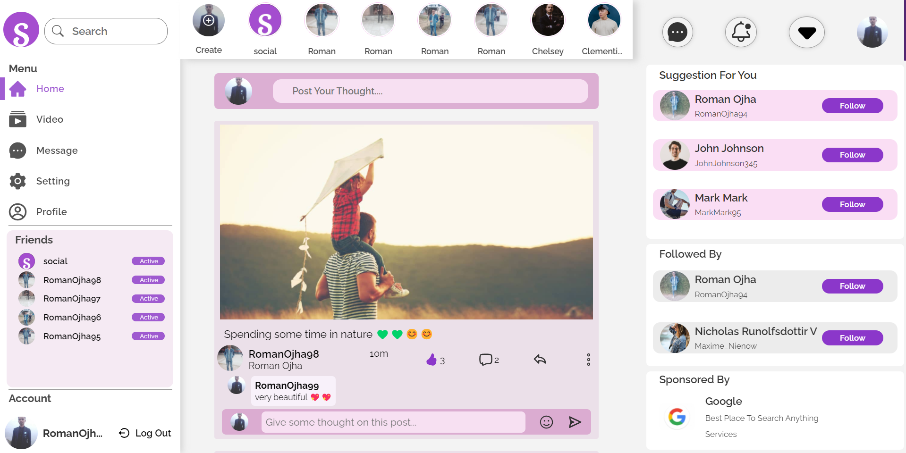
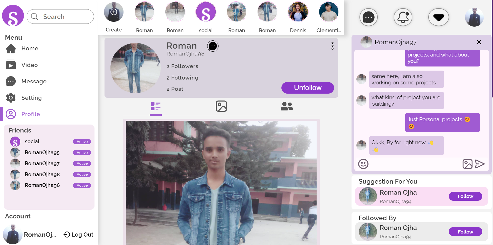
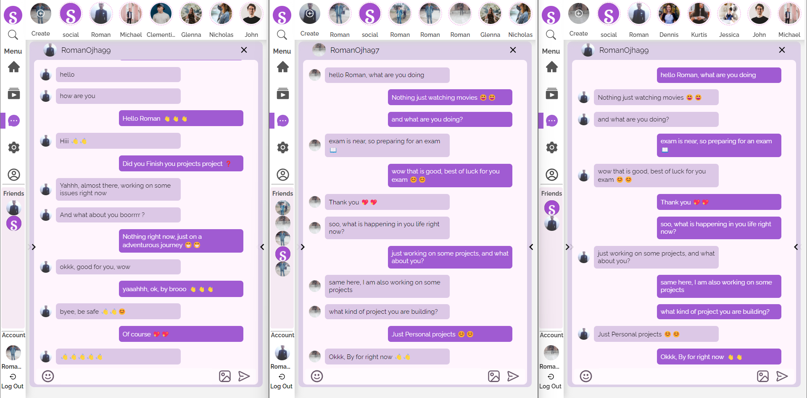
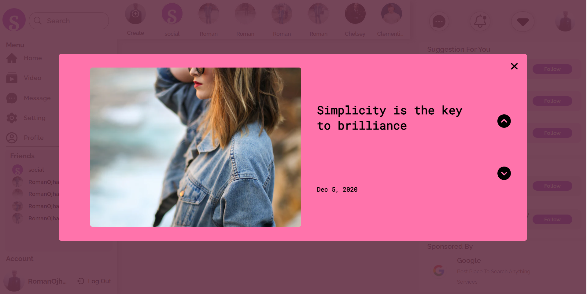
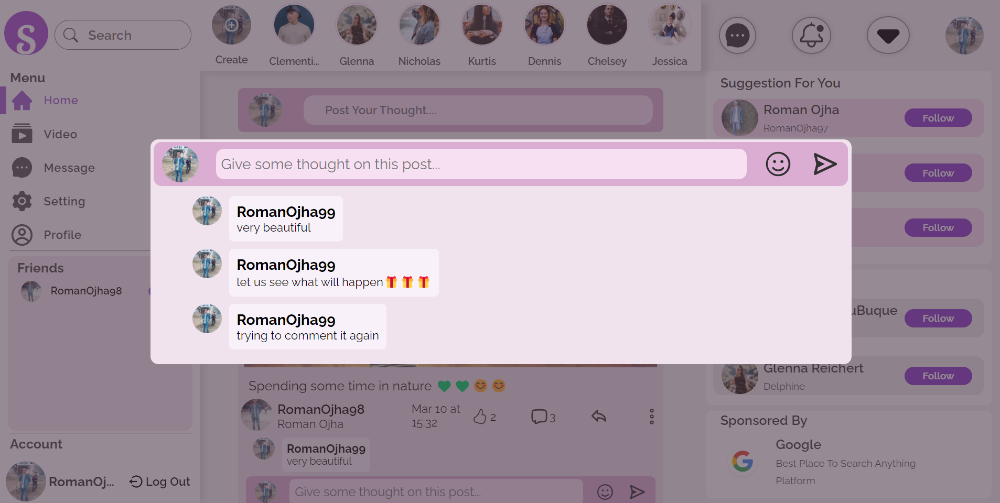
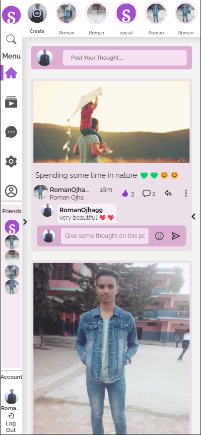
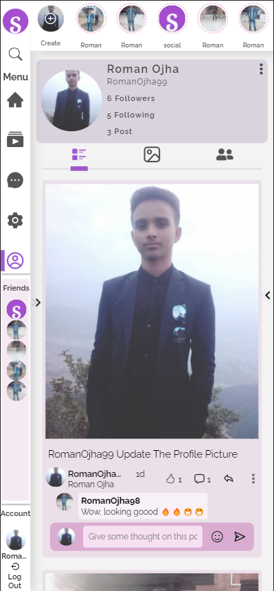

[<h1 style="font-size:60px; width:100%;">Social</h1>](./appIcon.ico)
  

  
# 🤝Social-Media Application🤝

## Technology Used:
| Technology   | Description        |
| ------------ | ------------------ |
| React        | Client Side        |
| Node/Express | Backend API        |
| MongoDB      | No-SQL Database    |
| Firebase     | For Storing Images |

## Features:
* You can Follow/UnFollow user
* You can Post your thought
* You can comment on posts
* You can like the post
* You can chat to other users in real time
* You can see other user stories that you had followed on
* You can see your's and other users profiles
* You can change profile picture, unique userID/username, displayed name or password
* You can watch and search videos from video page
* You would get the notification if someone follows you

[<h1>Todo</h1>](TODO.md "Todo")

[<h1>Run Locally</h1>](RUN_LOCALLY.md "Run Locally")

### Home Page:
[</img>](assets/UI/Home_Page.png)

### Profile Page:
[</img>](assets/UI/Profile_Page.png)

### Message Page:
[</img>](assets/UI/Message_Page.png)

### Stories Page:
[</img>](assets/UI/Story_Page.png)

### SignUp Page :
[</img>](assets/UI/Sign_Up_Page.png)

### SignIn Page :
[</img>](assets/UI/Sign_In_Page.png)

### Comment Box:
[</img>](assets/UI/Comment_Box.png)

### Mobile View:

[</img>](assets/UI/Home_Page_Mobile_View.png)
[</img>](assets/UI/ProfilePage_Mobile_View.png)

 
