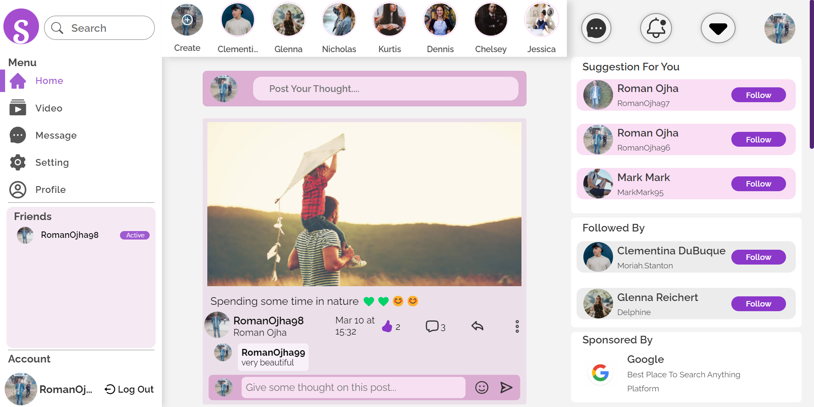
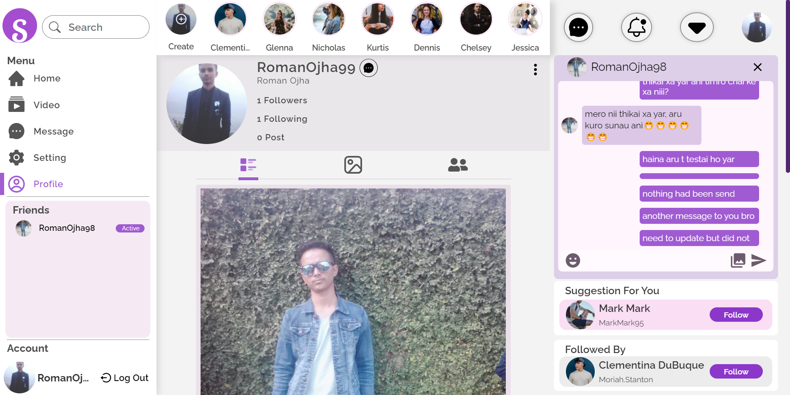
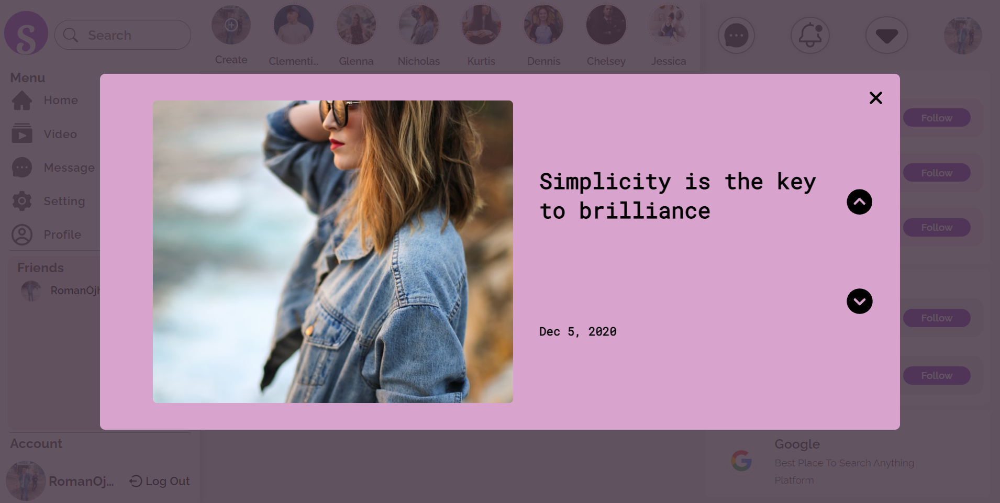
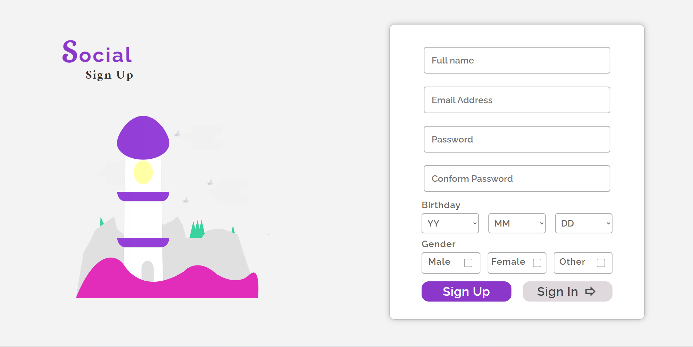
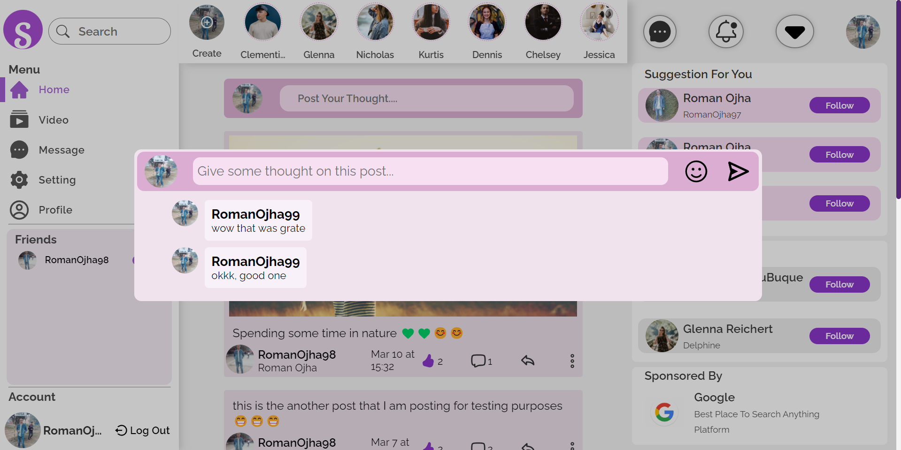
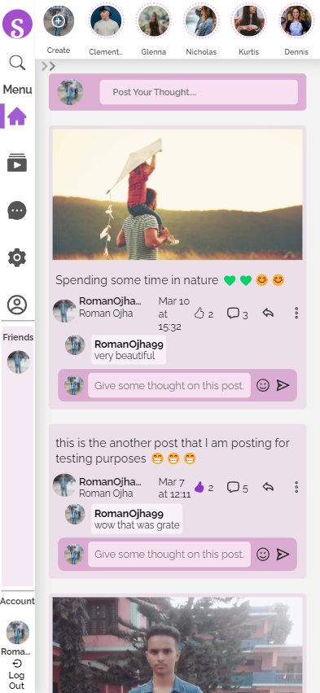

[<h1 style="font-size:60px; width:100%;">Social</h1>](./appIcon.ico)
  

  
# 🤝Social-Media Application🤝

## Technology Used:
1. ReactJs -> Client Side
2. NodeJs -> Server Side
3. MongoDB -> To store userDetail
4. Firebase -> To store images/files

### Home Page:
[</img>](Interface/Home_Page.png)

### Profile Page:
[</img>](Interface/Profile_Page.png)

### Stories Page:
[</img>](Interface/Story_Page.png)

### SignUp Page :
[</img>](Interface/Sign_Up_Page.png)

### SignIn Page :
[</img>](Interface/Sign_In_Page.png)

### Comment Box:
[</img>](Interface/Comment_Box.png)

### Mobile View:

[</img>](Interface/Home_Page_Mobile_View.png)
[</img>](Interface/Story_Page_Mobile_View.png)

 

[<h1>Todo</h1>](todo.md "Todo")

## How to run Locally:

### NOTE: Firstly you need to install node.js in you local computer

### API:
1. Directory `Social-Application`
2. Create `.env` file in Project Directory
3. Get all the environment variables which are include in `.env.example`
4. Get Firebase SDK Service Account Key & Connect MongoDB
5. Include Google Oauth services in application
6. Run `npm install --global yarn` to install yarn
7.  Run `npm install -g nodemon` to install nodemon
8. Run `yarn` to install all packages
9. Run `yarn start` to run the server

### Web:
1. Directory `Social-Application/client`
2. Create `.env` file in Project Directory
3. Get all the environment variables which are include in `.env.example`
4. Run `yarn` to install all packages
5. Run `yarn start` to run the client Site

